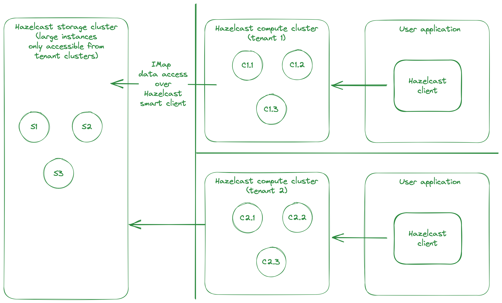

# Multi-tenant compute & storage planes

Use a single fat Hazelcast cluster as storage plane for multiple tenants. No user code is deployed or executed in the storage cluster. `IMap` access is restricted with client permissions, so each tenant can only access their own data.

Each tenant is provided their own dedicated compute cluster. These can be instances with just enough memory to execute Hazelcast, since no data reside in the compute cluster. Instead, `IMap` data are accessed via Hazelcast client to the storage cluster. User code (Jet jobs, entry procesors) is deployed and executed on the compute cluster.  



## Try it out locally

Quick instructions to try out storage/compute planes locally with Hazelcast open source (no security).

### Run your storage cluster

Run two vanilla Hazelcast open-source 5.2.1 members. Configure those members with cluster name `storage` with port 5701. e.g. use `hz start` with an appropriate `hazelcast.xml` or start member from Java:

```java
Config config = new Config();
config.setClusterName("storage");
HazelcastInstance member = Hazelcast.newHazelcastInstance(config); 
```

### Run your compute cluster

Build Hazelcast from this branch. Configure and run members using Hazelcast binary packaged from this branch. e.g. you can add configuration to `HazelcastMemberStarter` and run it:

```java
Config config = new Config();
// enable remote map proxying
config.setProperty(ClusterProperty.MAP_REMOTE_CLUSTER_ENABLED.getName(), "true");
// configure the client connection
// alternatively, the internal client that connects to storage
// can also pick up default hazelcast-client.xml or any
// custom config file via system property -Dhazelcast.client.config=/.../hazelcast-client.xml
config.setProperty(ClusterProperty.MAP_REMOTE_CLUSTER_ADDRESS.getName(), "127.0.0.1:5701");
config.setProperty(ClusterProperty.MAP_REMOTE_CLUSTER_NAME.getName(), "storage");
config.getNetworkConfig().setPort(5901);
config.setClusterName("compute");
HazelcastInstance hz = Hazelcast.newHazelcastInstance(config);
```

### Run a sample client

Try the setup:

```java
    public static void main(String[] args) {
        HazelcastInstance client = computeClient();
        HazelcastInstance storageClient = storageClient();

        IMap<String, String> stringMap = client.getMap("strings");
        for (int i = 0; i < 100; i++) {
            stringMap.put("" + i, "" + i);
            // ensure data was written
            if (!stringMap.get("" + i).equals(""+i)) {
                throw new RuntimeException("fail at " + i);
            }
        }
        for (int i = 0; i < 100; i++) {
            System.out.println(stringMap.get("" + i));
        }
        // we do not implement remote map proxying for map.size, so you
        // will see the actual size of the map on the compute cluster being 0
        System.out.println("... but size (not proxied) is: " + stringMap.size());
        // compute cluster is aware of its own proxies
        System.out.println("compute client DOs: " + client.getDistributedObjects());
        // but on storage side, they are prefixed with the cluster name
        // if you run another compute cluster by another name, its own objects
        // will be visible here
        System.out.println("storage client DOs: " + storageClient.getDistributedObjects());
    }

    static HazelcastInstance storageClient() {
        ClientConfig cc = new ClientConfig();
        cc.getNetworkConfig().addAddress("127.0.0.1:5701");
        cc.setClusterName("storage");
        return HazelcastClient.newHazelcastClient(cc);
    }

    static HazelcastInstance computeClient() {
        ClientConfig cc = new ClientConfig();
        cc.getNetworkConfig().addAddress("127.0.0.1:5901");
        cc.setClusterName("compute");
        return HazelcastClient.newHazelcastClient(cc);
    }
```

Notice that only a few `IMap` operations are actually implemented with remote map proxying, so if you want to try more operations, check if it's implemented in package `com.hazelcast.map.impl.operation.remote`. 